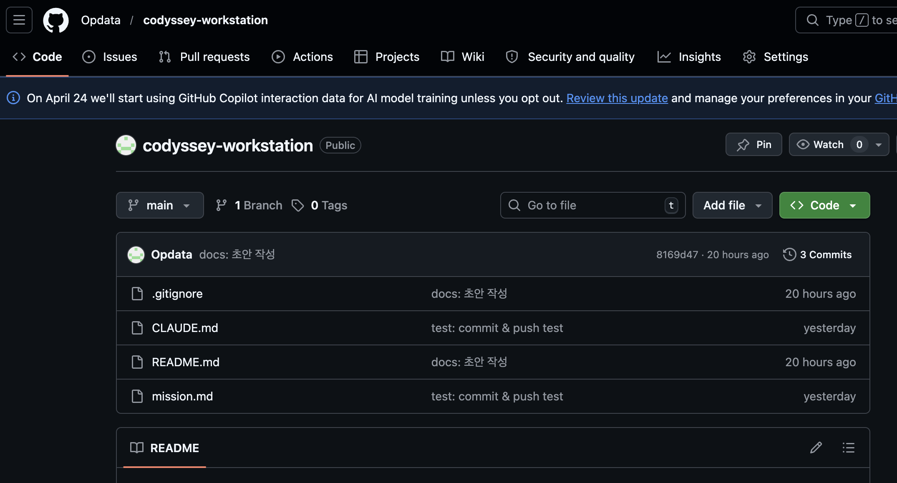

## 1. 프로젝트 개요

누구나 동일한 방식으로 실행/배포/디버그할 수 있는 환경을 구성하기 위해 워크스테이션을 구축한다.</br>
이 과정에서 CLI, Docker, Git/GitHub를 사용한다.
이 미션은 터미널로 디렉토리 권한 정리 / Docker를 설치, 실행, 운영/관리 한다.</br>
커스텀 Docker 이미지 제작, 포트 매핑, 볼륨 영속성 검증까지 CLI 기반으로 전 과정을 수행한다.</br>
이 경험은 이후 리눅스 트러블슈팅, CI/CD 파이프라인, 클라우드 배포/운영 등으로 자연스럽게 확장된다.</br>

---

## 2. 실행 환경

| 항목     | 버전 / 값            |
| -------- | -------------------- |
| OS       | macOS 26.3           |
| Shell    | zsh                  |
| Terminal | 기본 터미널          |
| Docker   | 9.3.1, build c2be9cc |
| Git      | 2.33.0               |

---

## 3. 터미널 조작 로그

```zsh
# cd, pwd, ls -al, mkdir, cp, mv, rm, cat, touch 등

$ cd ..
$ pwd # 현재 작업 중인 디렉토리의 절대 경로를 출력
/Users/jun/Documents/GitHub/codyssey-work/workstation

$ ls -al # 목록 확인(숨김 파일, 디렉토리 포함)
total 16
drwxr-xr-x  4 jun  staff   128  4 26 10:38 .
drwxr-xr-x  3 jun  staff    96  4 26 10:37 ..
drwxr-xr-x  3 jun  staff    96  4 26 10:38 .git
-rw-r--r--  1 jun  staff  1354  4 26 10:38 .gitignore
-rw-r--r--  1 jun  staff  4096  4 26 10:38 README.md

$ mkdir test # test 디렉토리 생성
$ ls -al
total 16
drwxr-xr-x  4 jun  staff   128  4 26 10:38 .
drwxr-xr-x  3 jun  staff    96  4 26 10:37 ..
drwxr-xr-x  3 jun  staff    96  4 26 10:38 .git
-rw-r--r--  1 jun  staff  1354  4 26 10:38 .gitignore
-rw-r--r--  1 jun  staff  4096  4 26 10:38 README.md
-rw-r--r--  1 jun  staff     0  4 26 10:38 test

$ cp test test2 # test 디렉토리를 test2로 복사
$ ls -al
total 16
drwxr-xr-x  4 jun  staff   128  4 26 10:38 .
drwxr-xr-x  3 jun  staff    96  4 26 10:37 ..
drwxr-xr-x  3 jun  staff    96  4 26 10:38 .git
-rw-r--r--  1 jun  staff  1354  4 26 10:38 .gitignore
-rw-r--r--  1 jun  staff     0  4 26 10:38 README.md
-rw-r--r--  1 jun  staff     0  4 26 10:38 test
-rw-r--r--  1 jun  staff     0  4 26 10:38 test2

$ mv test test3 # test 디렉토리의 이름을 test3로 변경
$ ls -al
total 16
drwxr-xr-x  4 jun  staff   128  4 26 10:38 .
drwxr-xr-x  3 jun  staff    96  4 26 10:37 ..
drwxr-xr-x  3 jun  staff    96  4 26 10:38 .git
-rw-r--r--  1 jun  staff  1354  4 26 10:38 .gitignore
-rw-r--r--  1 jun  staff     0  4 26 10:38 README.md
-rw-r--r--  1 jun  staff     0  4 26 10:38 test2
-rw-r--r--  1 jun  staff     0  4 26 10:38 test3

$ mv test2 mvtestDir # test2 디렉토리를 mvtestDir로 이동
$ ls -al mvtestDir
drwxr-xr-x  3 jun  staff   96  4월  2 13:39 .
drwxrw-r--@ 9 jun  staff  288  4월  2 13:39 ..
drwxr-xr-x  2 jun  staff   64  4월  2 13:38 test2

$ rm -r mvtestDir # mvtestDir 디렉토리 삭제
$ ls -al
drwxrw-r--@  8 jun  staff    256  4월  2 13:41 .
drwxr-xr-x   3 jun  staff     96  4월  1 20:18 ..
drwxr-xr-x@ 15 jun  staff    480  4월  1 21:25 .git
-rw-r--r--@  1 jun  staff     28  4월  1 20:18 .gitignore
-rw-r--r--@  1 jun  staff   8893  4월  2 13:40 README.md

$ cat README.md # README.md 파일 내용 출력
## 1. 프로젝트 개요
...
....

$ touch test.txt # test.txt 빈 파일 생성
$ ls -al
-rw-r--r--   1 jun  staff      0  4월  2 13:45 test.txt
```

### 터미널 조작 커맨드 설명

| 커맨드   | 설명                                                          | 예시1           | 예시2                |
| -------- | ------------------------------------------------------------- | --------------- | -------------------- |
| `pwd`    | 현재 작업 중인 디렉토리의 절대 경로를 출력                    | `pwd`           |                      |
| `ls -la` | 현재 디렉토리 목록 출력 (-l: 자세한 정보, -a: 숨김 파일 포함) | `ls -la`        | `ls -la /tmp`        |
| `mkdir`  | 새로운 디렉토리를 생성                                        | `mkdir test`    | `mkdir -p a/b/c`     |
| `cp`     | 파일 또는 디렉토리를 복사                                     | `cp test test2` | `cp test /tmp/test2` |
| `mv`     | 파일 또는 디렉토리를 이동하거나 이름을 변경                   | `mv test test3` | `mv test /tmp/test3` |
| `rm`     | 파일 또는 디렉토리를 삭제                                     | `rm test2`      | `rm -r testdir`      |
| `cat`    | 파일의 내용을 출력                                            | `cat README.md` | `cat /etc/hosts`     |
| `touch`  | 빈 파일을 생성하거나 파일의 타임스탬프를 업데이트             | `touch test`    | `touch a.txt b.txt`  |

---

## 4. 권한 실습 및 증거

```zsh
# 변경 전
drwxr-xr-x@  8 jun  staff   256  4월  1 21:43 workstation

# workstation 디렉토리 권한을 744로 변경
$ chmod 744 workstation
drwxr--r--@  8 jun  staff   256  4월  1 21:43 workstation

# workstation 디렉토리 그룹 쓰기 권한 변경
$ chmod g+w workstation
$ ls -al
drwxrw-r--@  8 jun  staff   256  4월  1 21:43 workstation

# test.txt 소유자만 권한 가지도록
$ chmod 700 test.txt
$ ls -al
-rwx------@  1 jun  staff     0  4월  2 21:45 test.txt
```

---

## 5. Docker 설치 및 기본 점검

```zsh
# Apple Silicon
curl -o Docker.dmg "https://desktop.docker.com/mac/main/arm64/Docker.dmg"

# Intel
curl -o Docker.dmg "https://desktop.docker.com/mac/main/amd64/Docker.dmg"

# 마운트 & 카피
hdiutil attach Docker.dmg
cp -R /Volumes/Docker/Docker.app /Applications
hdiutil detach /Volumes/Docker

# Docker 버전 확인
$ docker --version
Docker version 29.3.1, build c2be9cc

# Docker 전체 시스템 정보(커널 버전, 컨테이너 수 등등)
$ docker info
Client:
 Version:    29.3.1
 Context:    desktop-linux
 Debug Mode: false
 Plugins:
  agent: Docker AI Agent Runner (Docker Inc.)
    Version:  v1.34.0
    Path:     /Users/jun/.docker/cli-plugins/docker-agent
  ai: Docker AI Agent - Ask Gordon (Docker Inc.)
    Version:  v1.20.1
    Path:     /Users/jun/.docker/cli-plugins/docker-ai
  buildx: Docker Buildx (Docker Inc.)
  ....
```

---

## 6. Docker 기본 운영

```zsh
# Docker image pull(nginx:alpine & linux alpine)
$ docker pull nginx:alpine & docker pull alpine

# Docker image list
$ docker images
IMAGE           ID             DISK USAGE   CONTENT SIZE   EXTRA
alpine:latest   25109184c71b       13.6MB         4.28MB
nginx:alpine    e7257f1ef28b       92.7MB         26.7MB

# Docker container 실행(background, name, port 옵션 추가)
$ docker run -d --name nginx-test -p 8080:80 nginx:alpine
92f0a1e63159905c3c250b21d263b0b29a0906fa03ff263b7d6fabff64774e7c

$ docker run -d --name alpine-test alpine:latest
27110dc322e5781c728a1c5431a15b48aa84d897f525ab19364c6c3ea3cb24ab

# docker 컨테이너 확인
$ docker ps -a
| CONTAINER ID | IMAGE | STATUS | PORTS | NAMES |
| ------------ | ----- | ------ | ----- | ----- |
| `27110dc322e5` | `alpine:latest` | Exited (0) 1 minute ago | - | alpine-test |
| `92f0a1e63159` | `nginx:alpine` | Up 1 minute | 0.0.0.0:8080->80/tcp | nginx-test |

# docker 컨테이너 로그 확인
$ docker logs nginx-test
/docker-entrypoint.sh: /docker-entrypoint.d/ is not empty, will attempt to perform configuration
...

# docker 리소스 확인
$ docker stats -a
CONTAINER ID NAME CPU % MEM USAGE / LIMIT MEM % NET I/O BLOCK I/O PIDS
27110dc322e5 alpine-test 0.00% 0B / 0B 0.00% 0B / 0B 0B / 0B 0
92f0a1e63159 nginx-test 0.00% 15.94MiB / 7.653GiB 0.20% 1.79kB / 126B 8.09MB / 12.3kB 11
```

---

## 7. 컨테이너 실행 실습

### hello-world

```zsh
# hello-world 출력 확인(nginx-test 컨테이너 실행 및 내부 html을 hello-world로 변경)
$ curl http://localhost:8080
<!DOCTYPE html>
<html>
<head>
<title>hello-world</title>
<body>
<h1>hello-world</h1>
</body>
</html>
```

### ubuntu 컨테이너 진입

```zsh
# ubuntu 컨테이너 실행 및 sleep infinity로 붙잡기
$ docker run -d --name alpine-test alpine:latest sleep infinity
/ #

# 이후 간단한 명령어 수행
/ # ls
bin    dev    etc    home   lib    media  mnt    opt    proc   root   run    sbin   srv    sys    tmp    usr    var
/ # echo "hi"
hi
```

### attach vs exec 차이

|               | `docker attach`                        | `docker exec`                        |
| ------------- | -------------------------------------- | ------------------------------------ |
| **동작**      | 컨테이너의 메인 프로세스(PID 1)에 연결 | 컨테이너 안에서 새 프로세스를 실행   |
| **종료 시**   | `exit` 입력 시 컨테이너 자체가 종료됨  | `exit` 입력해도 컨테이너는 계속 실행 |
| **사용 목적** | 메인 프로세스 출력 확인, 직접 제어     | 실행 중인 컨테이너에 추가 명령 실행  |
| **주로 사용** | 로그 스트림 확인                       | 디버깅, 파일 확인, 셸 진입           |

---

## 8. Dockerfile 기반 커스텀 이미지

**선택한 베이스 이미지:** nginx:alpine

**커스텀 포인트 및 목적:**

| 커스텀 항목                                            | 목적            |
| ------------------------------------------------------ | --------------- |
| LABEL org.opencontainers.image.title="my-custom-nginx" | 이미지 메타정보 |
| COPY static/ /usr/share/nginx/html                     | 정적 파일 복사  |
| ENV APP_ENV=dev                                        | 환경변수 설정   |

```zsh
# Dockerfile 빌드(현재 디렉토리에 Dockerfile이 있다고 가정)
$ docker build -t custom-nginx .

# 빌드된 이미지 확인
$ docker images

# Docker 컨테이너 실행(background, name, port 옵션 추가)
$ docker run -d --name custom-nginx -p 8080:80 custom-nginx

$ curl http://localhost:8080
<!doctype html>
<html lang="en">
  <head>
    <meta charset="UTF-8" />
    <meta name="viewport" content="width=device-width, initial-scale=1.0" />
    <title>NEW INDEX HTML</title>
  </head>
  <body></body>
</html>
# 추후 기입
```

---

## 9. 포트 매핑

```zsh
# 추후 기입
$ docker run -d --name nginx-test -p 3000:80 nginx:alpine

$ curl http://localhost:3000
<!DOCTYPE html>
<html>
<head>
<title>Welcome to nginx!</title>
<style>
html { color-scheme: light dark; }
body { width: 35em; margin: 0 auto;
font-family: Tahoma, Verdana, Arial, sans-serif; }
</style>
</head>
<body>
<h1>Welcome to nginx!</h1>
<p>If you see this page, nginx is successfully installed and working.
...
</body>
</html>
```

---

## 10. 바인드 마운트 (호스트 변경 전/후 비교)

```zsh
# 추후 기입
```

---

## 11. Docker 볼륨 영속성 검증 (컨테이너 삭제 전/후)

```zsh
# vol-test 라는 이름의 volume 생성
$ docker volume create vol-test

# vol-test 라는 이름의 volume 확인
$ docker volume ls
DRIVER    VOLUME NAME
local     vol-test

$ docker run -d --name alpine-test -v vol-test:/app/data alpine:latest sleep infinity
912ffe72aeb465c788a637a3d62efe1f08e1d89a183d3b8181420feef062537c

# alpine-test 컨테이너 내부로 진입 및 /app/data 위치에 빈파일 생성
$ docker exec -it alpine-test sh
/ # ls
app    bin    dev    etc    home   lib    media  mnt    opt    proc   root   run    sbin   srv    sys    tmp    usr    var
/ # cd app
/app # ls
data
/app # cd data/
/app/data # ls
/app/data # touch test.txt
/app/data # ls
test.txt

# alpine-test 컨테이너 삭제
$ docker rm -f alpine-test

# 임시 컨테이너 생성 후 볼륨 데이터 유지 확인
$ docker run -it --rm -v vol-test:/app/data alpine sh
/ # ls -al app/data/
total 8
drwxr-xr-x    2 root     root          4096 Apr  2 08:26 .
drwxr-xr-x    3 root     root          4096 Apr  2 08:32 ..
-rw-r--r--    1 root     root             0 Apr  2 08:26 test.txt

# vol-test 라는 이름의 volume 삭제 및 확인
$ docker volume rm vol-test
$ docker volume ls
DRIVER    VOLUME NAME
```

---

## 12. Git 설정 및 GitHub 연동

```zsh
# Git 사용자 정보 설정
$ git config --global user.name "이름"
$ git config --global user.email "이메일"
$ git config --list
core.excludesfile=~/.gitignore
...
user.name=Opdata
user.email=pb03641@gmail.com
...
```

```zsh
# GitHub 연동
git init
git remote add origin git@github.com:Opdata/codyssey-workstation.git
git push -u origin main
```

### GitHub 연동 확인



---

## 13. 검증 방법

| 항목          | 명령어                                 | 확인 내용                             |
| ------------- | -------------------------------------- | ------------------------------------- |
| Docker 설치   | `docker --version`                     | 버전 출력 확인                        |
| 데몬 동작     | `docker info`                          | 오류 없이 정보 출력                   |
| 이미지 목록   | `docker images`                        | 빌드한 이미지 존재 확인               |
| 컨테이너 목록 | `docker ps -a`                         | 실행/중지 컨테이너 확인               |
| 컨테이너 로그 | `docker logs <name>`                   | 컨테이너 출력 로그 확인               |
| 리소스 사용   | `docker stats`                         | CPU/메모리 사용량 확인                |
| 포트 매핑     | `curl http://localhost:8080`           | 응답 확인                             |
| 바인드 마운트 | 호스트 파일 수정 후 컨테이너 내부 확인 | 변경사항 실시간 반영 확인             |
| 볼륨 영속성   | `docker exec` + `cat`                  | 컨테이너 삭제 후에도 데이터 유지 확인 |
| Git 설정      | `git config --list`                    | user.name, user.email 확인            |
| GitHub 연동   | `ssh -T git@github.com`                | 인증 성공 메시지 확인                 |

---

## 14. 수행 체크리스트

- [x] 터미널 기본 조작 (pwd, ls -la, mkdir, cp, mv, rm, cat, touch)
- [x] 권한 변경 실습 (chmod — 파일 1개, 디렉토리 1개, 변경 전/후 비교)
- [x] Docker 설치 및 데몬 점검 (docker --version, docker info)
- [x] hello-world 컨테이너 실행
- [x] ubuntu 컨테이너 실행 및 내부 진입 (ls, echo 수행)
- [x] attach vs exec 차이 관찰 및 정리
- [x] Docker 운영 명령 수행 (docker logs, docker stats)
- [x] Dockerfile 작성 및 커스텀 이미지 빌드 (베이스 이미지 선택 + 커스텀 포인트 목적 기술)
- [x] 포트 매핑 접속 성공 (curl 또는 브라우저 스크린샷)
- [x] 바인드 마운트 반영 확인 (호스트 변경 전/후 비교)
- [x] Docker 볼륨 영속성 검증 (컨테이너 삭제 전/후)
- [x] Git 설정 확인 (git config --list)
- [x] GitHub SSH 연동 완료 및 증거 첨부

---

## 15. 트러블슈팅

### Case 1: 추후 기입

| 항목      | 내용                                                                                                                                                        |
| --------- | ----------------------------------------------------------------------------------------------------------------------------------------------------------- |
| 문제      | docker exec -it로 alpine 컨테이너 접속 시도했더니 Error response from daemon: container is not running 에러 발생                                            |
| 원인 가설 | 컨테이너가 이미 종료된 상태                                                                                                                                 |
| 확인      | docker ps -a 로 확인 → STATUS 컬럼이 Exited 로 표시됨                                                                                                       |
| 해결      | Alpine은 실행할 프로세스(PID 1)가 없으면 즉시 종료되기 때문에 docker run -it alpine sh 또는 docker run -d alpine sleep infinity 로 프로세스를 붙잡아줘야 함 |

### Case 2: 추후 기입

| 항목      | 내용                                                                         |
| --------- | ---------------------------------------------------------------------------- |
| 문제      | docker exec -it [컨테이너] bash 로 alpine 컨테이너 접속 시도했더니 에러 발생 |
| 원인 가설 | alpine 이미지에는 bash가 설치되어 있지 않음                                  |
| 확인      | alpine은 용량을 최소화한 경량 이미지라 bash 대신 sh만 기본                   |
| 해결      | docker exec -it [컨테이너] sh 로 접속                                        |
